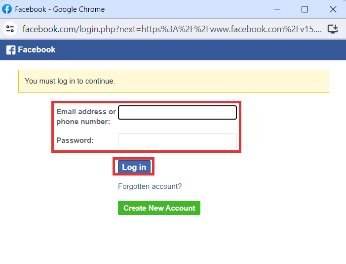

# 📖 Instagram Bot Creation

Follow these quick steps to create your Instagram chatbot:-

1. To start creating your new chatbot, click **"Create New Bot."**
2. Choose the primary objective for your bot and continue to the next step.
3. Click on "**Instagram Chatbot**" to begin creating your chatbot.
4. Click on “**Login**” and enter your login credentials.
5. Enter your phone number or email address and click “**Log in**.” To create a new Facebook account, select “**Create New Account.**”

<figure><figcaption></figcaption></figure>

6. Now, click on **“Get Started”** and sign into your Instagram Account. Once signed in, you will be directed to the below screen:
7. Select the Business account to start your Instagram Chatbot and click “**Next**”.

<figure><figcaption></figcaption></figure>

2. Verify your business contact information and fill in the remaining details.

<figure><figcaption></figcaption></figure>

2. Finish up by clicking on "**Save**"

Congratulations! You have just successfully created your new Instagram chatbot.

